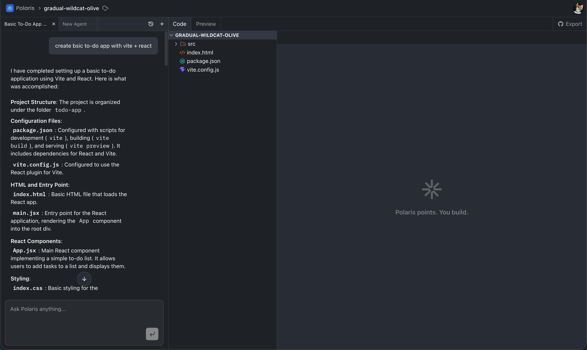
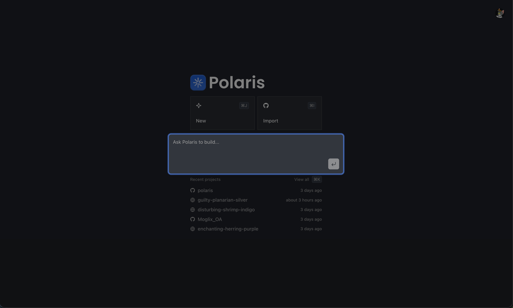
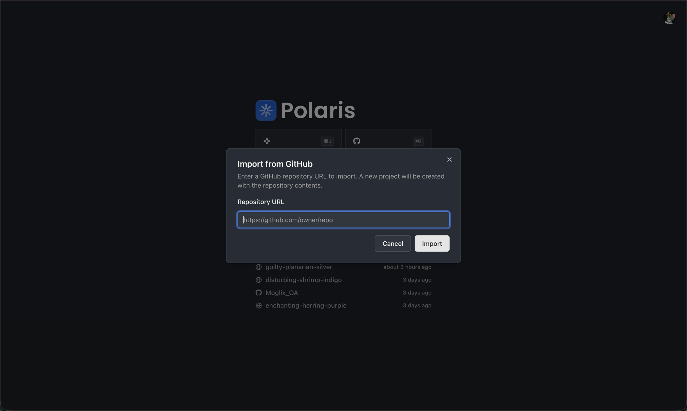
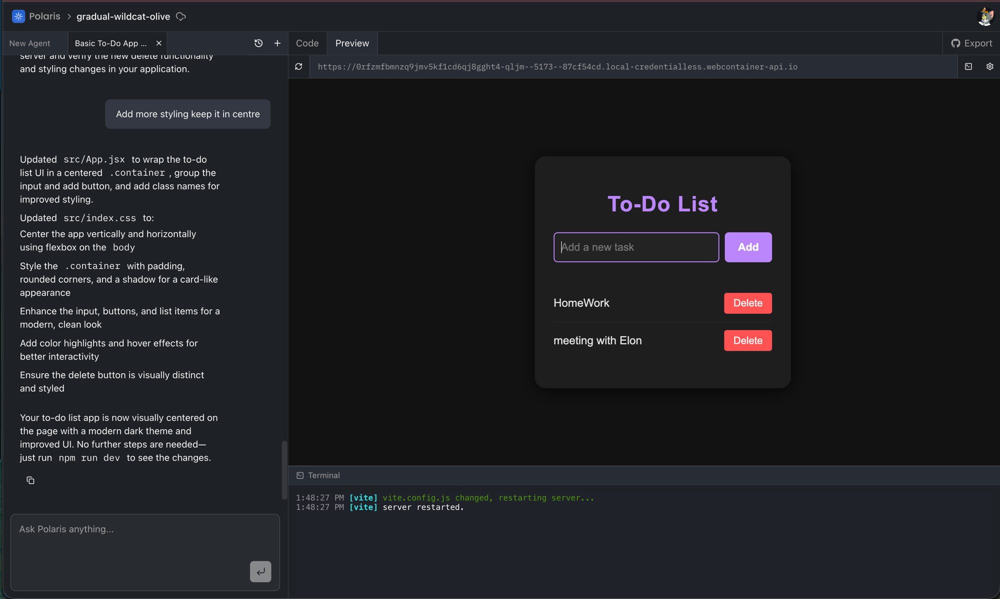
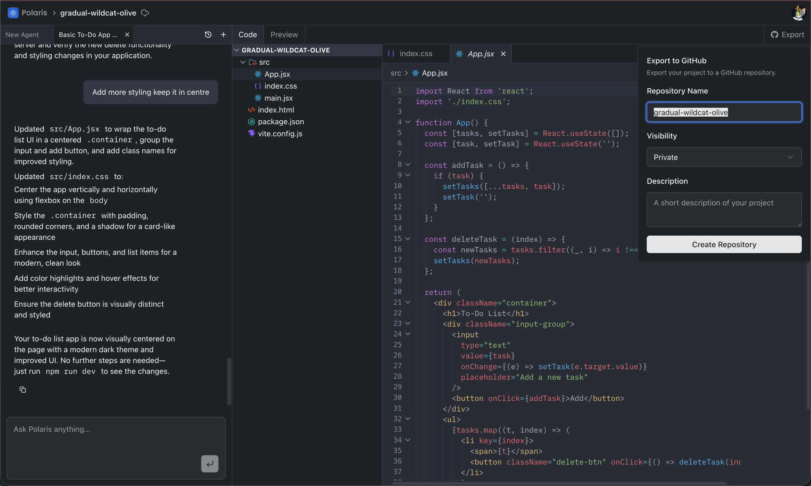
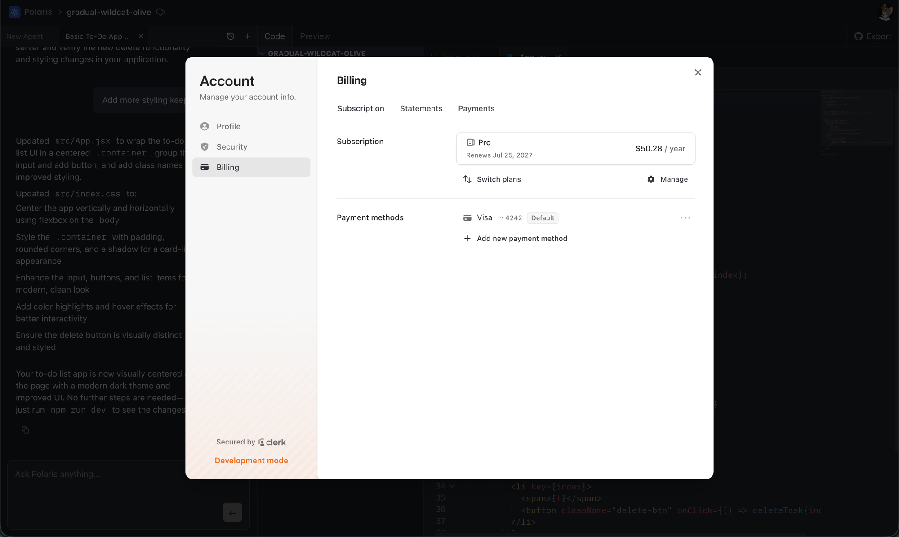
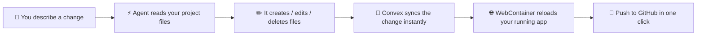

<div align="center">
  
  <h1>Polaris</h1>
  <p><strong>A Polaris for your ideas. Build, run, and ship — entirely in the browser.</strong></p>

  <a href="https://github.com/HarshiLMalani07/polaris">
    
  </a>
  &nbsp;
  
  
  
  
  

  <br /><br />

  
</div>

---

## What is Polaris?

Polaris is a **full IDE that lives in your browser** — with an AI agent sitting next to you the whole time.

Describe what you want. The agent reads your project, writes the files, and explains what it changed. Then Polaris **boots your app right there in the browser** — real `npm install`, real dev server, real terminal — no local setup, no containers to configure. When you're happy with it, push the whole thing to GitHub in one click.

Nothing to install. Nothing to configure. Just you and the next line.

---

## A Quick Tour

### 1. Start from a prompt — or from an existing repo

Describe the app you want and Polaris scaffolds it, or paste a GitHub URL and bring an existing codebase in as-is. `⌘J` to start something new, `⌘I` to import, `⌘K` to jump to any project you've touched.





---

### 2. Write code — or ask the agent to

A real editor on the left, an AI agent on the right. The agent has actual tools: it lists, reads, creates, updates, renames, and deletes files in your project, and can scrape a URL when it needs docs it doesn't have.

Inside the editor you also get **inline ghost-text completions** and **quick edit** — select a block, describe the change, watch it rewrite in place.

Chats open as **tabs**, so you can keep several threads going and switch between them like files. Nothing is ever lost — the full history is one click away.


---

### 3. Run it — live, in the browser

Flip to Preview. Polaris installs your dependencies and boots the dev server inside a WebContainer, with a full terminal attached. Your app runs in the same tab you wrote it in.



---

### 4. Ship it

Export any project straight to a new GitHub repo — public or private, description included.



Plans and payment are handled by Clerk, right inside the app.



---

## How It All Works



> The agent runs as a durable background job on **Inngest**, so the editor never blocks and a long task survives a refresh. Cancel it mid-run and the job stops cleanly.

---

## ✨ Features

| | Feature |
|---|---|
| 🤖 | **AI agent with real tools** — reads, writes, renames, deletes files and scrapes the web for context |
| ⌨️ | **In-editor AI** — ghost-text completions and select-and-describe quick edits |
| 🌐 | **Live preview** — your app actually runs in the browser via WebContainers |
| 🖥️ | **Real terminal** — full xterm session wired to the running container |
| 📁 | **File explorer + tabbed editor** — create, rename, delete, organize |
| 💬 | **Tabbed AI chats** — multiple threads per project, all searchable |
| 🐙 | **GitHub import & export** — bring a repo in, push a project out |
| ⚡ | **Real-time sync** — Convex pushes every change to every open tab |
| 🔐 | **Auth & billing** — sign-in and Pro plans handled by Clerk |

---

## 🛠️ Tech Stack

| What it does | Tool |
|---|---|
| Web framework | [Next.js 16](https://nextjs.org) + React 19 |
| AI agent | [OpenAI GPT-4.1](https://platform.openai.com) |
| Agent runtime | [Inngest](https://inngest.com) + [Agent Kit](https://agentkit.inngest.com) |
| Real-time database | [Convex](https://convex.dev) |
| In-browser runtime | [WebContainers](https://webcontainers.io) |
| Terminal | [xterm.js](https://xtermjs.org) |
| Auth & billing | [Clerk](https://clerk.com) |
| Code editor | [CodeMirror 6](https://codemirror.net) |
| Web scraping (agent context) | [Firecrawl](https://firecrawl.dev) |
| UI | [Tailwind CSS v4](https://tailwindcss.com) + [shadcn/ui](https://ui.shadcn.com) |
| Error monitoring | [Sentry](https://sentry.io) |

---

## 🚀 Run It Yourself

### Prerequisites

- [Node.js](https://nodejs.org) 20+
- Accounts on [Convex](https://convex.dev), [Clerk](https://clerk.com), [Inngest](https://inngest.com), and [OpenAI](https://platform.openai.com)

### Steps

```bash
# 1. Clone the repo
git clone https://github.com/HarshiLMalani07/polaris.git
cd polaris

# 2. Install dependencies
npm install

# 3. Set up environment variables
cp .env.example .env.local
# Fill in the values — see the table below

# 4. Start Convex (in its own terminal)
npx convex dev

# 5. Start Inngest (in its own terminal, needed for the AI agent)
npx inngest-cli@latest dev

# 6. Start the app
npm run dev
```

Open [http://localhost:3000](http://localhost:3000).

### Environment Variables

```env
# Clerk — auth and billing
NEXT_PUBLIC_CLERK_PUBLISHABLE_KEY=
CLERK_SECRET_KEY=
CLERK_JWT_ISSUER_DOMAIN=

# Convex
CONVEX_DEPLOYMENT=
NEXT_PUBLIC_CONVEX_URL=
NEXT_PUBLIC_CONVEX_SITE_URL=
POLARIS_CONVEX_INTERNAL_KEY=   # shared secret the agent uses to write to Convex

# AI — OPENAI_API_KEY powers the agent; the rest are optional
GEMINI_API_KEY=
GOOGLE_GENERATIVE_AI_API_KEY=
MISTRAL_API_KEY=
OPENAI_API_KEY=

# Inngest
INNGEST_DEV=1                  # local dev only

# Firecrawl — optional, enables the agent's web scraping tool
FIRECRAWL_API_KEY=

# Sentry — optional
SENTRY_AUTH_TOKEN=
```

> **Note:** Clerk needs a **GitHub OAuth connection** enabled for import/export to work, and **Clerk Billing** with a `pro` plan for the Pro-gated features.

---

## 📄 License

MIT — use it, learn from it, build on it. See [LICENSE](./LICENSE).

Contributions are welcome — start with [CONTRIBUTING.md](./CONTRIBUTING.md).

---

<div align="center">
  <sub>Built by <a href="https://github.com/HarshiLMalani07">Harshil Malani</a></sub>
</div>
